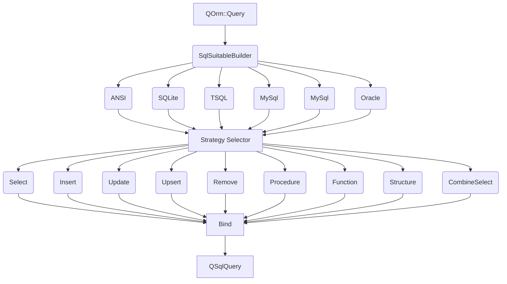

# QOrm

**Builder to working querys.**


## Working architecture

>## Support
> ANSI, MySQL, SQlite, Oracle, Postgres-PSQL, SQLServer-TSQL



## Prerequisits
>```bash
> mkdir myproject;
> cd myproject;
> git clone git@github.com:flaviomarcio/qstm.git;
> git clone git@github.com:flaviomarcio/qorm.git;
>```
>Check example in QOrm/example/crud


## CMake Build information

>```
>## initial CMake parameters 
>
>-GNinja
>-DCMAKE_BUILD_TYPE:STRING=Debug
>-DCMAKE_PROJECT_INCLUDE_BEFORE:PATH=%{IDE:ResourcePath}/package-manager/auto-setup.cmake
>-DQT_QMAKE_EXECUTABLE:STRING=%{Qt:qmakeExecutable}
>-DCMAKE_PREFIX_PATH:STRING=%{Qt:QT_INSTALL_PREFIX}
>-DCMAKE_C_COMPILER:STRING=%{Compiler:Executable:C}
>-DCMAKE_CXX_COMPILER:STRING=%{Compiler:Executable:Cxx}
>-DCMAKE_INSTALL_PREFIX=~/build/qcrosscache/install/Debug
>```

>```bash
> cd qorm
> mkdir build;
> cd build;
> cmake ..
> make;
> make install;
>```

## QMake Build information

>```bash
> cd qorm
> qmake qorm.pro
> make;
> make install;
> ls -l;
>```

## Configure QMake project

>```c++
>CONFIG += c++17
>CONFIG += console
>CONFIG += silent
>CONFIG -= debug_and_release
>QT += gui core widgets
>
>TEMPLATE = app
>TARGET = demo
>
>include($$PWD/../../../qstm/qstm.pri)
>include($$PWD/../../../qorm/qorm.pri)
>
>HEADERS += \
>    $$PWD/personModel.h \
>    $$PWD/personController.h
>
>SOURCES += \
>    $$PWD/personController.cpp \
>    $$PWD/main.cpp
>
>RESOURCES += \
>    $$PWD/settings.qrc
>```

## Resource settings

>Settings for connection database server saved in setting.json and included in settings.qrc
>```json
>{
>   "connection":{
>       "secret": "YzUxNDFhMDA5",
>       "enviroment" : "debug",
>       "paramaters" : {
>           "debug":{
>               "driver":"QPSQL",
>               "hostName":"localhost",
>               "userName":"localuser",
>               "password":"localuser",
>               "port":5432,
>               "dataBaseName":"postgres",
>               "schemaNames":"public"
>           }
>       }
>   }
>}
>```

## Implementation method for create connection using connection manager

>Check example in QOrm/example/crud
>```c++
> 
>//main implementation
>#include <QCoreApplication>
>
>//include of model and controller
>#include "./personModel.h"
>#include "./personController.h"
>
>Q_GLOBAL_STATIC(QOrm::ConnectionManager, connectionManager);
>
>//!
>//! \brief createConnection
>//! \param connection
>//! \return
>//! method for create connection
>bool createConnection(QSqlDatabase&connection)
>{
>    //set settings to run service
>    if(!connectionManager->setSettingsFileName(QStringLiteral(":/settings.json"))){
>        qWarning()<<"invalid settings";
>        return 0;
>    }
>
>    //request new connection
>    if(!connectionManager->pool().get(connection))
>        return false;
>
>    return true;
>}
>
>int main(int argc, char *argv[])
>{
>     ...more
>}
>```

## Implementation method for chain person controller methods

>Check example in QOrm/example/crud
>```c++
>//main implementation
>
>int main(int argc, char *argv[])
>{
>    QCoreApplication a(argc, argv);
>
>    QSqlDatabase connection;
>
>    //create new connection
>    if(!createConnection(connection))
>        return 0;//normal exit
>
>    //controller person
>    PersonController controller(connection);
>
>    {//crud run
>        QVariantHash v{};//structure crud
>        qWarning()<<controller.crud(v);
>    }
>
>    //create uuid to person
>    auto personUuid=QUuid::createUuid();
>
>    {//insert/update for person
>        PersonModel model;
>        model.set_uuid(personUuid);
>        model.set_name("Nick");
>        model.set_enabled(true);
>        qWarning()<<controller.upsert(model.toHash());
>    }
>
>    {//get for person
>        //by uuid
>        qWarning()<<controller.get(personUuid);
>
>        //by model body
>        PersonModel model(personUuid);
>        qWarning()<<controller.get(model.toHash());
>    }
>
>    {//list records for person
>        //by uuid
>        qWarning()<<controller.list(personUuid);
>
>        //by model body
>        PersonModel model(personUuid);
>        qWarning()<<controller.list(model.toHash());
>    }
>
>    {//remove for person
>        //by uuid
>        qWarning()<<controller.remove(personUuid);
>
>        //by model body
>        PersonModel model(personUuid);
>        qWarning()<<controller.remove(model.toHash());
>    }
>
>    {//list parent for person
>        //by uuid
>        qWarning()<<controller.listPersonParent(personUuid);
>
>        //by model body
>        PersonModel model(personUuid);
>        qWarning()<<controller.listPersonParent(model.toHash());
>    }
>
>    {//list and check for person
>        //by uuid
>        qWarning()<<controller.listPersonCheck(personUuid);
>
>        //by model body
>        PersonModel model(personUuid);
>        qWarning()<<controller.listPersonCheck(model.toHash());
>    }
>
>    {//update dt_record for person using multi tasks connection
>        qWarning()<<controller.runMultiTasks();
>    }
>
>    return a.exec();
>}>
>```

## Implementation PersonModel Mapper

>Check example in QOrm/example/crud
>
>```c++
>#include <QOrm>
>//!
>//! \brief The PersonModel class
>//! 
>//! inherits of QOrm::Model
>class PersonModel : public QOrm::Model
>{
>    Q_OBJECT
>public:
>    QORM_MODEL(PersonModel)//make default methods for PersonModel
>    QORM_DECLARE_MODEL_DESCRIPTION(tr("Person"))//description
>    QORM_DECLARE_TABLE_SCHEMA()//declare schema name in database
>    QORM_DECLARE_TABLE(tab000,_,person)//table in database
>    QORM_DECLARE_TABLE_PRIMARY_KEY(uuid)//inform PK name
>    QORM_DECLARE_TABLE_FOREIGN_KEY(parent_uuid)//declare FK
>    QORM_DESCRIPTOR_ORDERBY(name)//declare default order by
>public:
>    QORM_DECLARE_PROPERTY(QUuid  , uuid         , uuidGenerator()   )//declare field and default value
>    QORM_DECLARE_PROPERTY(QDate  , dt_record    , QDate()           )//declare field and default value
>    QORM_DECLARE_PROPERTY(QUuid  , parent_uuid  , QUuid()           )//declare field and default value
>    QORM_DECLARE_PROPERTY(QString, name         , QString()         )//declare field and default value
>    QORM_DECLARE_PROPERTY(bool   , enabled      , false             )//declare field and default value
>public:
>    QORM_MODEL_CONSTRUCTOR(PersonModel, QOrm::Model)//contructors for PersonModel
>};
>
>//REGISTER MODEL AND DECLARE CRUD AND DAO
>QORM_DECLARE_CRUD(PersonModel)
>```


## Implementation PersonController

>Check example in QOrm/example/crud
>
>```c++
>#include <QOrm>
>
>//!
>//! \brief The PersonController class
>//!
>//! inherits of QOrm::Controller
>class PersonController : public QOrm::Controller
>{
>    Q_OBJECT
>public:
>    //!
>    //! \brief personController
>    //! \param parent
>    //!
>    //! constructor controller to pass current connection
>    QORM_CONTROLLER_CONSTRUCTOR(PersonController)
>
>    //!
>    //! \brief crud
>    //! \param vBody
>    //! \return
>    //! example of CRUD
>    ResultValue &crud(const QVariant &vBody);
>
>    .....more
>
>};

>```


## Using QOrm::ModelDao
>Check example in QOrm/example/crud
>## Using CRUD methods
>
>```c++
>ResultValue &PersonController::crud(const QVariant &vBody)
>{
>    //Person CRUD
>    PersonModelCRUD crud(vBody, this);
>    return this->lr(crud.crudify());//return success/error and created object
>}
>```

>## Using  upsert/insert/update/remove methods
>
>```c++
>ResultValue &PersonController::upsert(const QVariant &v)
>{
>    //Person generic dao
>    PersonModelGDao dao(this);
>    PersonModel model(v);
>
>    //insert or update record
>    if(!dao.upsert(model))
>        return this->lr();//return error
>
>    return this->lr(model.toHash());//return success and created object
>}
>
>ResultValue &PersonController::insert(const QVariant &v)
>{
>    //Person generic dao
>    PersonModelGDao dao(this);
>
>    //remove record
>    return this->lr(dao.insert(v));//return successful/error
>}
>
>ResultValue &PersonController::update(const QVariant &v)
>{
>    //Person generic dao
>    PersonModelGDao dao(this);
>
>    //remove record
>    return this->lr(dao.update(v));//return successful/error
>}
>
>ResultValue &PersonController::remove(const QVariant &v)
>{
>    //Person generic dao
>    PersonModelGDao dao(this);
>
>    //remove record
>    return this->lr(dao.remove(v));//return successful/error
>}
>```
>## Using record/recordList methods
>
>```c++
>ResultValue &PersonController::record(const QVariant &v)
>{
>    //Person generic dao
>    PersonModelGDao dao(this);
>
>    //get record
>    return this->lr(dao.record(v));//return success/error and record
>}
>
>ResultValue &PersonController::recordList(const QVariant &v)
>{
>    //Person generic dao
>    PersonModelGDao dao(this);
>
>    //get record
>    return this->lr(dao.recordList(v));//return success/error and record
>}
>```
>
>>## Using  query buider strategy
>
>```c++
>ResultValue &PersonController::listPerson(const QVariant &v)
>{
>    QOrm::Query query(this);
>
>    auto&select=query.builder().select();
>
>    select
>        .fields(PersonModelR)
>        .from(PersonModelR);
>
>    select
>        .where()
>        .equal(PersonModelM.parent_uuid_field(), v);
>
>    //execute query
>    if(!query.exec())
>        return this->lr();//return error
>
>    //make record list
>    return this->lr(query.makeRecordList());//return successful and record list
>}
>
>ResultValue &PersonController::listPersonParent(const QVariant &v)
>{
>    QOrm::Query query(this);
>
>    auto&select=query.builder().select();
>
>    select
>        .fields()
>        .f(PersonModelM.uuid_field("a"))
>        .f(PersonModelM.parent_uuid_field("a"))
>        .f(PersonModelM.name_field("a"))
>        .f(PersonModelM.enabled_field("a"));
>    select
>        .from(PersonModelR, "a");
>
>    select
>        .joinInner(PersonModelR).alias("b")
>        .equal(PersonModelM.parent_uuid_field("b"), PersonModelM.parent_uuid_field("a"));
>
>    select
>        .where()
>        .equal(PersonModelM.parent_uuid_field("a"), v);
>
>    //execute query
>    if(!query.exec())
>        return this->lr();//return error
>
>    //make record list
>    return this->lr(query.makeRecordList());//return successful and record list
>}
>```
>
>>## Using  multi tasks execute
>
>```c++
>ResultValue &PersonController::runMultiTasks()
>{
>    //lamba to async update record
>
>    auto errorUpdateDate=[](QSqlDatabase&, const QVariant&)
>    {
>        qWarning()<<"It\'s not OK";
>        //..action to error
>        return QVariant();
>    };
>
>    auto successUpdateDate=[](QSqlDatabase&, const QVariant&)
>    {
>        qWarning()<<"it\'s OK";
>        //..action to success
>        return QVariant();
>    };
>
>    auto executeUpdateDate=[](QSqlDatabase&connection, const QVariant&record){
>        //Person generic dao
>        PersonModelGDao dao;
>        dao.setConnection(connection);//individual connection to task
>        PersonModel model(record);//load body model
>        model.set_dt_record(QDate::currentDate());//update dt
>
>        if(!dao.upsert(model))//insert/update person
>            return dao.lr().toHash();//record body error
>
>        return model.toHash();//return new body object
>    };
>
>    PersonModelGDao dao(this);//dao to current connection
>    auto vList=dao.recordList().resultToList();//list all personModel record
>
>    QOrm::TaskRunner taskRunner(this);//task runner controller
>    taskRunner
>        .slotCount(QThread::idealThreadCount())//maximum thread in actual machine
>        .values(vList)//personModel records
>        .onExecute(executeUpdateDate)//lambda to async execute
>        .onFailed(errorUpdateDate)//lambda to error notify
>        .onSuccess(successUpdateDate)//lambda to success notify
>        .start();//wait to finish
>
>    return this->lr(taskRunner.lr());//return successful/error
>
>}
>```